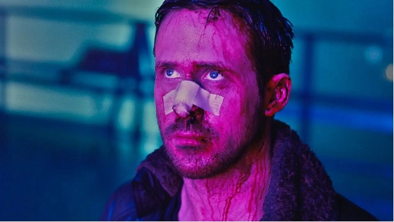

# Color Palette Extractor

A Python tool that uses K-means clustering to extract dominant colors from images. This application analyzes images to create visual color palettes, making it ideal for designers, artists, and developers working on color-based projects.

## 🎨 Overview
This tool analyzes any input image and automatically identifies its most representative colors, creating a visual palette that captures the essence of the image's color scheme. It uses the K-means clustering algorithm to intelligently group similar colors and find the most dominant ones.

## 🌟 Features
- Extract dominant colors from any image format
- Customize the number of colors to extract
- Generate visual color palettes
- Display RGB values for each extracted color
- Save palettes as PNG files
- User-friendly command-line interface

## 🛠️ Technologies used
- Python 3.x
- OpenCV (Image processing)
- scikit-learn (K-means clustering)
- NumPy (Numerical operations)
- Matplotlib (Visualization)

## 🧩 Installation

1. Clone the repository:
```
git clone https://github.com/felipevidela/color-palette-extractor.git
cd color-palette-extractor
```


2. Create a virtual environment
```
python3 -m venv venv
```

3. Activate the virtual environment
For macOS/Linux:

```
source venv/bin/activate
```

For Windows:

```
venv\Scripts\activate
```

4. Install required packages:

```
pip install -r requirements.txt
```

Usage
1. Run the program:

```
python color_palette_extractor.py
```

2. Follow the menu options:

- **Option 1**: Load an image (provide the image path)
- **Option 2**: Generate color palette (specify number of colors)
- **Option 3**: Save the current palette
- **Option 4**: Exit

Example:

# 🖼️ Load image
1. Enter image path: example.jpg

# 🎨Generate palette
2. Enter number of colors: 5

# 💾 Save palette
3. Enter save path: my_palette.png

Requirements

- opencv-python
- numpy
- scikit-learn
- matplotlib

## 🎨 Examples

### Example 1: Desert Scene

Generated color palette:


### Example 2: Neon Scene

Generated color palette:


Contributing
Feel free to fork the project and submit pull requests.
License
This project is licensed under the MIT License - see the LICENSE file for details.


